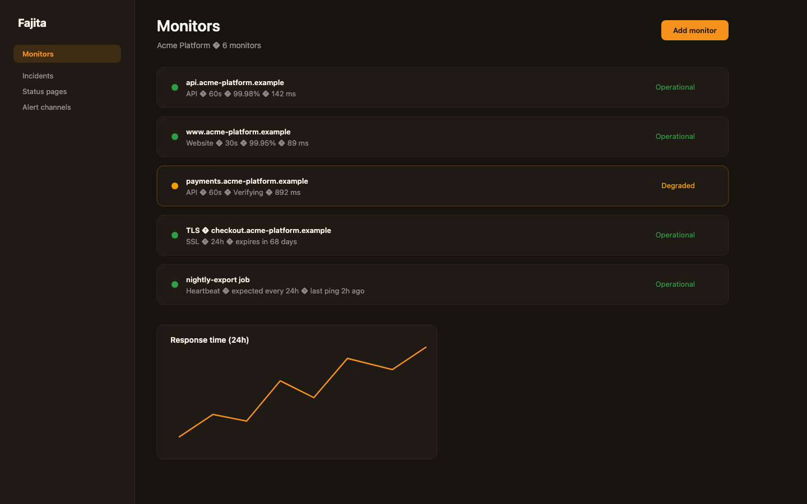
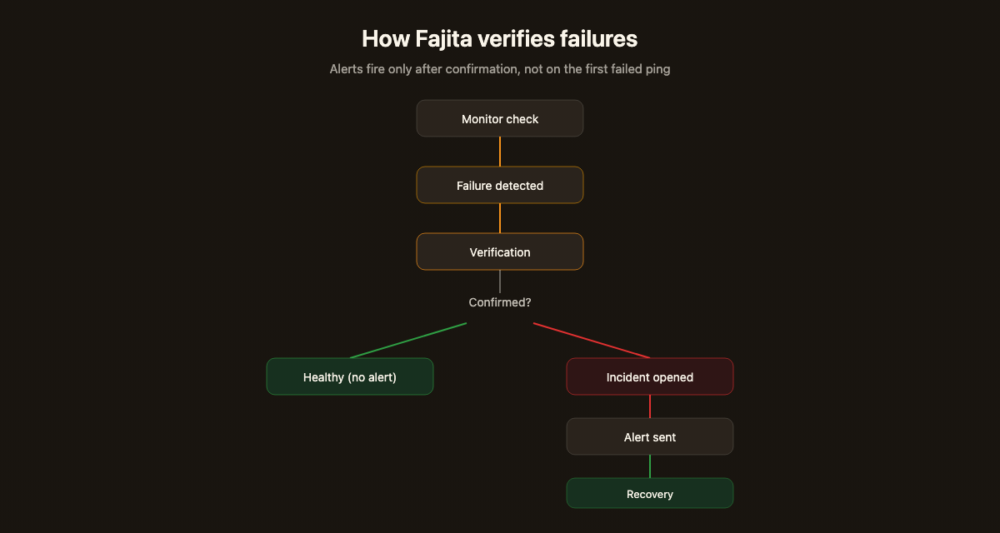
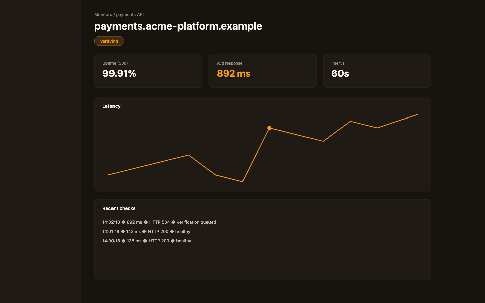
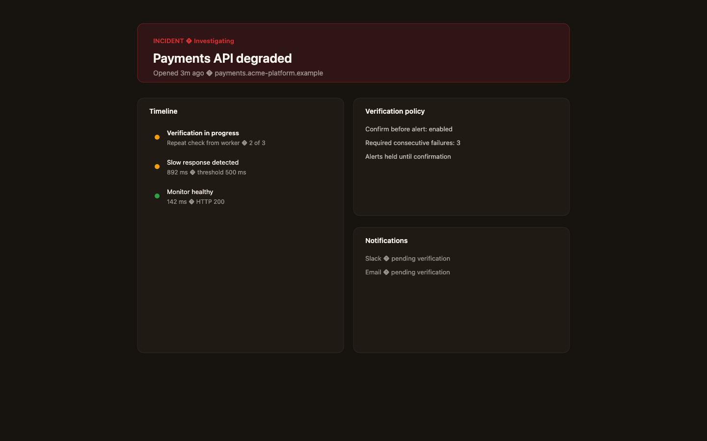
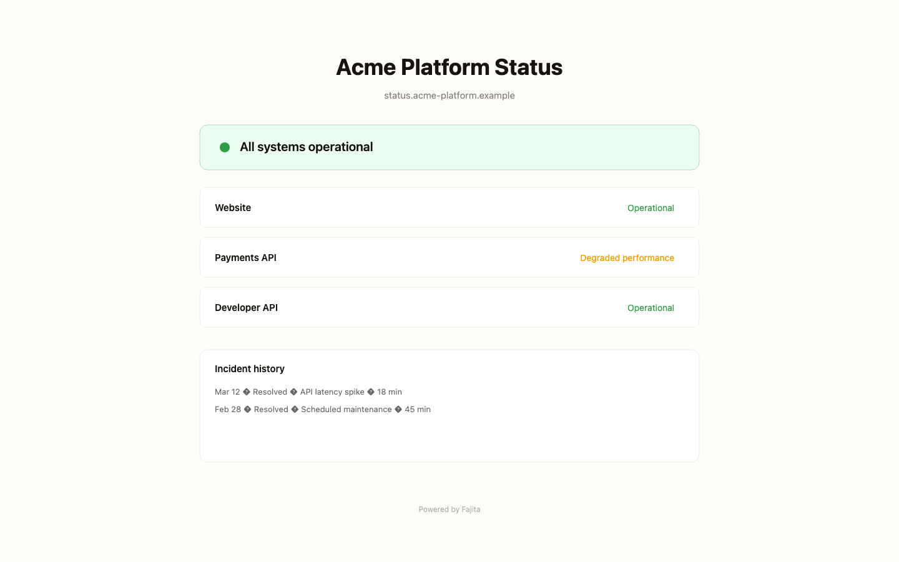

<div align="center">



# Fajita

**Open-source uptime monitoring that verifies failures before waking you up.**

Monitor websites, APIs, SSL certificates, and cron jobs. Fajita verifies trouble before it alerts you.

[Website](https://fajita.io) · [Documentation](https://fajita.io/docs) · [Self-host](./docs/self-hosting/QUICKSTART.md) · [Fajita Cloud](https://fajita.io)

[](./LICENSE)
[](https://github.com/fajita-io/fajita/actions/workflows/oss-readiness.yml)
[](./docker-compose.yml)
[](./SECURITY.md)

</div>

## Why Fajita?

Most uptime tools alert on the first failed ping. A blip on the network, a slow deploy, a single timeout, and your team is awake for nothing.

```text
Single failed check → alert → interruption → site was fine
```

Fajita runs a verification step before escalating:

```text
Failed check → verify → confirm → alert only when warranted
```

Fajita verifies failures before escalating them, reducing alerts caused by transient network or endpoint issues. It does not eliminate false positives entirely, but it cuts noise where a single flaky check would otherwise page you.

## How verification works



1. A scheduled check runs against your monitor target.
2. If the check fails or crosses a threshold, Fajita queues verification instead of alerting immediately.
3. Repeat checks confirm whether the failure is real.
4. Only confirmed failures open incidents and send alerts.
5. Recovery closes the incident and notifies subscribers when appropriate.

See [docs/architecture/MONITORING.md](./docs/architecture/MONITORING.md) for the full execution model.

## Features

- **Website monitoring** with HTTP status, latency, and content assertions
- **API monitoring** with headers, methods, and JSON/body assertions
- **SSL certificate monitoring** with expiry warnings
- **Cron / heartbeat monitoring** for jobs that must check in on schedule
- **Failure verification** before incidents and alerts
- **Incident lifecycle** with timeline, status updates, and recovery
- **Public status pages** with components and incident history
- **Email alerts** via SMTP or Resend
- **Slack, Discord, and signed webhooks**
- **Maintenance windows** to suppress expected downtime
- **Team workspaces** with roles and audit history
- **Data export** for your organization

## Quick start

**Requirements:** Docker, Docker Compose, Node.js 22+, a [Clerk](https://clerk.com) application you control

```bash
git clone https://github.com/fajita-io/fajita.git
cd fajita
cp .env.example .env
# Set FAJITA_DEPLOYMENT_MODE=self_hosted, Clerk keys, CRON_SECRET, MONITOR_SECRET_KEYRING

docker compose up -d
npm run selfhost:doctor
```

Open [http://localhost:3000](http://localhost:3000), sign in, create a monitor.

Full guide: [docs/self-hosting/QUICKSTART.md](./docs/self-hosting/QUICKSTART.md)

## Architecture

```text
Web app → Scheduler → Workers → Verification → Incident engine → Notifications → Status page
```

| Component | Role |
| --- | --- |
| Next.js web app | UI, API routes, heartbeat ingestion |
| PostgreSQL | Product state, scheduler leases, incidents |
| PostgREST | Supabase-compatible API layer |
| Go monitor worker | Checks, verification drain, heartbeat miss detection |
| Alert worker | Slack, Discord, webhooks, email delivery |

Details: [docs/architecture/OVERVIEW.md](./docs/architecture/OVERVIEW.md)

## Self-hosting vs Fajita Cloud

Same core monitoring system. Different operational burden.

| Capability | Self-hosted | Fajita Cloud |
| --- | --- | --- |
| Monitoring | Yes | Yes |
| Failure verification | Yes | Yes |
| Status pages | Yes | Yes |
| Slack / Discord / webhooks | Yes | Yes |
| Email alerts | SMTP or your Resend | Managed |
| Infrastructure | You operate | Fajita operates |
| Backups | You | Managed |
| Updates | You | Managed |
| Worker operations | You | Managed |

Full comparison: [docs/SELF_HOSTED_VS_CLOUD.md](./docs/SELF_HOSTED_VS_CLOUD.md)

Prefer not to maintain it yourself? [Fajita Cloud](https://fajita.io) gives you the same core monitoring experience without managing workers, databases, backups, mail, or upgrades.

## Screenshots

<table>
<tr>
<td width="50%"></td>
<td width="50%"></td>
</tr>
<tr>
<td width="50%"></td>
<td width="50%"></td>
</tr>
</table>

## Documentation

| Topic | Link |
| --- | --- |
| Documentation index | [docs/README.md](./docs/README.md) |
| Self-hosting | [docs/self-hosting/](./docs/self-hosting/) |
| Configuration | [docs/self-hosting/CONFIGURATION.md](./docs/self-hosting/CONFIGURATION.md) |
| Upgrades | [docs/self-hosting/UPGRADING.md](./docs/self-hosting/UPGRADING.md) |
| Troubleshooting | [docs/self-hosting/TROUBLESHOOTING.md](./docs/self-hosting/TROUBLESHOOTING.md) |

## Contributing

Contributions are welcome. Read [CONTRIBUTING.md](./CONTRIBUTING.md) before opening a pull request.

- Development setup: [docs/contributing/DEVELOPMENT.md](./docs/contributing/DEVELOPMENT.md)
- Design expectations: [docs/contributing/DESIGN.md](./docs/contributing/DESIGN.md)
- Security disclosure: [SECURITY.md](./SECURITY.md)

## Security

Report vulnerabilities privately per [SECURITY.md](./SECURITY.md). Do not file public issues for exploitable problems.

Self-hosters: [docs/self-hosting/SECURITY.md](./docs/self-hosting/SECURITY.md)

## Roadmap

See [ROADMAP.md](./ROADMAP.md) for current priorities. No fixed dates; we ship what makes Fajita more reliable and easier to operate.

## License

Licensed under [AGPL-3.0](./LICENSE). Network-facing deployments must comply with AGPL source-sharing requirements.

The Fajita name, logo, and fajita.io are trademarks. See [TRADEMARKS.md](./TRADEMARKS.md).

Fajita is an open-source project created and maintained by Accomplish Labs. See [GOVERNANCE.md](./GOVERNANCE.md).

## Star the repo

If Fajita is useful to you, starring the repository helps more developers discover it.
