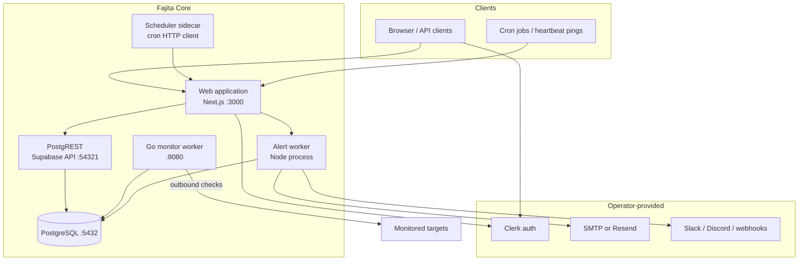

# Self-hosted architecture

Fajita self-hosting reuses the same application core as Fajita Cloud. Deployment adapters handle scheduling, billing, telemetry, and optional cloud services.

## Service map

## Mandatory services

| Service | Why |
| --- | --- |
| PostgreSQL | All product state, scheduler lease ledger, incidents |
| PostgREST | Supabase-compatible API used by the Next.js app |
| Web application | UI, API routes, heartbeat ingestion, auth shell |
| Go monitor worker | Leases due checks, executes monitors, runs verification drain |

## Optional services

| Service | Why |
| --- | --- |
| Scheduler sidecar | Calls `/api/cron/monitor-tick` and `/api/cron/tick` (replaces Vercel Cron) |
| Alert worker | Delivers Slack/Discord/webhook/email alerts off the request path |
| SMTP or Resend | Email alert and subscriber delivery |
| Clerk | Authentication (self-hosters use their own Clerk app) |

Redis is **not** required. Scheduling uses PostgreSQL lease functions.

## Monitor execution flow

1. **Schedule**: `check_schedules.next_run_at` determines due work.
2. **Lease**: Go worker calls `app.lease_due_checks()` with worker identity.
3. **Load**: Worker loads monitor config snapshot and decrypts secrets in memory.
4. **Execute**: HTTP/HTTPS/API checks via `httpcheck`; SSL via `tlscheck`; heartbeat monitors skip outbound requests.
5. **Finalize**: `app.finalize_check()` stores results idempotently and advances schedule.
6. **Evaluate**: `app.process_incident_evaluations()` applies failure verification rules.
7. **Incident**: Confirmed failures open incidents; recovery closes them.
8. **Notify**: Alert outbox consumed by alert worker or cron tick.

## Failure verification (self-hosted)

Production Fajita Cloud may use geographically distributed probes. Self-hosted verification uses **repeated checks from the local worker fleet** only. The same verification state machine runs; geographic diversity is not simulated.

Do not expect multi-region confirmation in a single-node install unless you deploy multiple workers in distinct regions with unique `MONITOR_WORKER_REGION` values.

## Heartbeat monitors

1. App generates a tokenized URL under `/api/heartbeat/{token}`.
2. External jobs POST/GET to that URL.
3. Worker and cron call `app.detect_missed_heartbeats()` for missed pulses.
4. Incidents follow the same engine as poll-based monitors.

## Ports (default Compose)

| Port | Service |
| --- | --- |
| 3000 | Web |
| 54321 | PostgREST |
| 5432 | PostgreSQL |
| 8080 | Monitor worker health/metrics |

## Persistence

- PostgreSQL volume: all relational state
- No separate queue persistence
- Encryption key (`MONITOR_SECRET_KEYRING`): required to decrypt stored monitor secrets

## Cloud-only (not required self-hosted)

- Vercel Cron
- Fajita Stripe billing enforcement
- Fajita DataFast / GA defaults
- Cloudflare DNS automation scripts
- Managed custom-domain TLS provisioning
